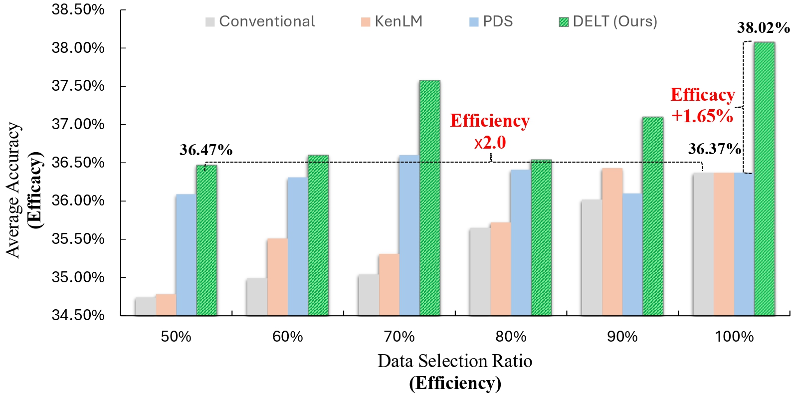
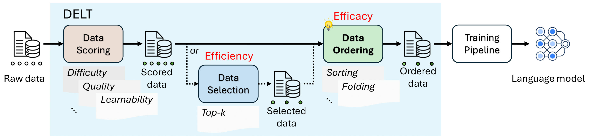
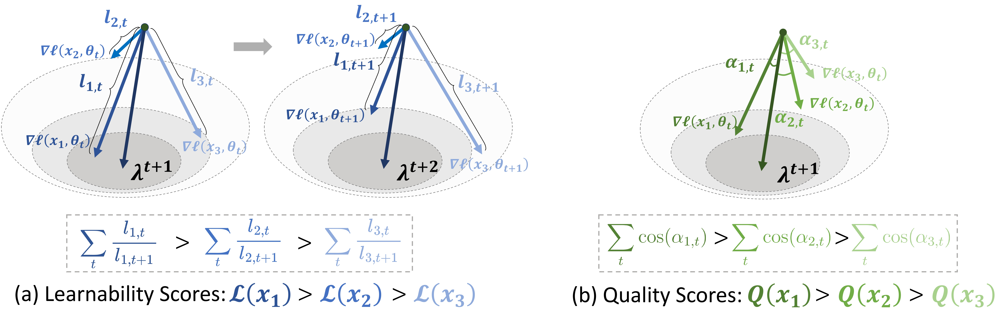
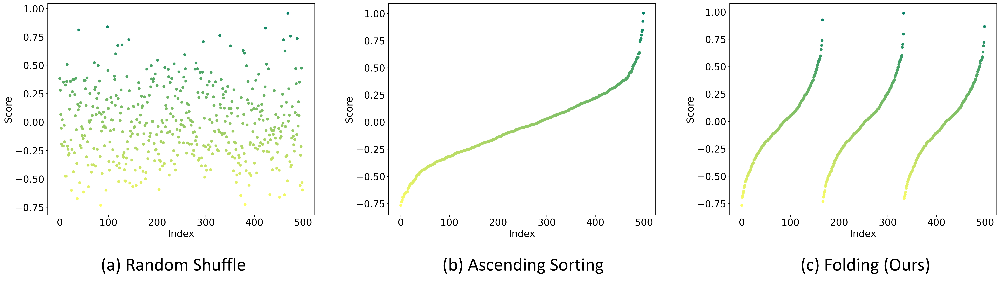

# Data Efficacy for Language Model Training

<p align="center">
  
  
 
</p>

<p align="center">
  <a href="https://arxiv.org/abs/2506.21545"><b>[📜 Paper]</b></a> •
  <a href="https://github.com/microsoft/DELT"><b>[🐱 GitHub Code]</b></a> •
  <a href="https://huggingface.co/microsoft/DELT"><b>[🤗 HF Model]</b></a>
</p>

<figure>
  
  <figcaption style="color: gray;">
    <div><small><em>Figure 1. Average result across 8 benchmarks for different methods. High performance at the same selection ratio indicates high efficacy, while achieving similar performance with a smaller selection ratio demonstrates high efficiency. Our method excels in both efficacy and efficiency.</em></small></div>
  </figcaption>
</figure>

## 🌟 Introduction
Data is fundamental to the training of language models (LM). Recent research has been dedicated to data efficiency, which aims to maximize performance by selecting a minimal or optimal subset of training data. Techniques such as data filtering, sampling, and selection play a crucial role in this area. To complement it, we define Data Efficacy, which focuses on maximizing performance by optimizing the organization of training data and remains relatively underexplored. This work introduces a general paradigm, DELT, for considering data efficacy in LM training, which highlights the significance of training data organization. DELT comprises three components: Data Scoring, Data Selection, and Data Ordering.

<figure>
  
  <figcaption style="color: gray;">
    <div align="center"><small><em>Figure 2. DELT paradigm.</em></small></div>
  </figcaption>
</figure>

<br>

For data scoring, we design **Learnability-Quality Scoring (LQS)** method, which considers both the learnability and quality of each data sample from the gradient consistency perspective.

<figure>
  
  <figcaption style="color: gray;">
    <div align="center"><small><em>Figure 3. Learnability-Quality Scoring (LQS).</em></small></div>
  </figcaption>
</figure>

<br>

For data ordering, we devise **Folding Ordering (FO)** method, which addresses issues such as model forgetting and data distribution bias.

<figure>
  
  <figcaption style="color: gray; text-align: center;">
    <div align="center"><small><em>Figure 4. Folding Ordering (FO).</em></small></div>
  </figcaption>
</figure>


## 📢 News and Updates

Done
- [x] 2025/06/28: 💥The [Arxiv paper](https://arxiv.org/abs/2506.21545) released.
- [x] 2025/08/31: 💥The DELT code released for pre-training on general domain.

TBD
- [ ] Release the model of LQS data scorer on general domain (CommonCrawl).
- [ ] Release the DELT code for post-training on specific domain.


## ⚙️ Environment Installation

```bash
conda create -n data_efficacy python=3.10 -y
conda activate data_efficacy
pip install -r requirements.txt
```

## 💾 Preparation.

<details open>
<summary>Environment Variables</summary>

```bash
export HF_TOKEN="<your_huggingface_token>"
export WANDB_API_KEY="<your_wandb_apikey>"
```
</details>

<details open>
<summary>Dataset</summary>

```bash
python utils.py --content dataset --id $HF_DATASET_ID --save-dir $OUTPUT_DATA_PATH

# e.g. python utils.py --content=dataset --id=togethercomputer/RedPajama-Data-1T --save-dir=data/source-cc-1b.jsonl --data-name=common_crawl --split-name=train --sample-size=500000
# If you want to try the dataset used in the paper, please use the below commandline:
# python utils.py --content=dataset --id=togethercomputer/RedPajama-Data-1T-Sample --save-dir=data/source-cc-1b.jsonl 
# You could also replace it with your own dataset under jsonl format. 
```
</details>

<details open>
<summary>Model</summary>

```bash
python utils.py --content=model --id $HF_MODEL_ID --save-dir $OUTPUT_MODEL_PATH

# e.g. python utils.py --content=model --id=Data-Selection/BSL-160M --save-dir=models/mistral-160m
# You could also replace it with your own model under hf format.
```
</details>

## ⏩ Quick Start.

<details open>
<summary>Data Scoring</summary>

Existing scoring method: **Learnability-Quality Score** (`lqs`), and Perplexity (`kenlm`).
For more details about LQS, please refer to [this guideline](./data_scoring/lqs/README.md).

```bash
bash data_scoring/entry.sh $INPUT_DATA_PATH $OUTPUT_DATA_PATH $METHOD $CONFIG_PATH

# e.g. bash data_scoring/entry.sh data/source-cc-1b.jsonl data/source-cc-1b_scored-lqs.jsonl lqs data_scoring/config/lqs.yaml
# Please note that LQS involves downloading Hugging Face gated models/datasets, and you need to configure it.
```
</details>

<details open>
<summary>Data Selection</summary>

Existing selection method: **Top-R** (`top-r`), Threshold (`threshold`), and Top-K (`top-k`).

```bash
bash data_selection/entry.sh $INPUT_DATA_PATH $OUTPUT_DATA_PATH $METHOD $CONFIG_PATH

# e.g. bash data_selection/entry.sh data/source-cc-1b_scored-lqs.jsonl data/source-cc-1b_scored-lqs_selected-r1.0.jsonl top-r data_selection/config/top-r.yaml
```
</details>

<details open>
<summary>Data Ordering</summary>

Existing ordering method: **Folding Ordering (FO)** (`folding`), Shuffle (`shuffle`), and Sorting (`sorting`).

```bash
bash data_ordering/entry.sh $INPUT_DATA_PATH $OUTPUT_DATA_PATH $METHOD $CONFIG_PATH

# e.g. bash data_ordering/entry.sh data/source-cc-1b_scored-lqs_selected-r1.0.jsonl data/source-cc-1b_scored-lqs_selected-r1.0_ordered-folding-l3.jsonl folding data_ordering/config/folding.yaml
```
</details>


<details open>
<summary>Model Training</summary>

```bash
bash model_train/entry.sh $INPUT_DATA_PATH $INPUT_MODEL_PATH $OUTPUT_MODEL_PATH $METHOD $CONFIG_PATH

# e.g. bash model_train/entry.sh data/source-cc-1b_scored-lqs_selected-r1.0_ordered-folding-l3.jsonl models/mistral-160m models/pretrain_mistral-160m_source-cc-1b_scored-lqs_selected-r1.0_ordered-folding-l3_src pretrain model_train/config/train.yaml
```
</details>


<details open>
<summary>Model Evaluation</summary>

```bash
bash model_eval/entry.sh $INPUT_MODEL_PATH $OUTPUT_RESULT_PATH $METHOD $CONFIG_PATH

# e.g. bash model_eval/entry.sh models/pretrain_mistral-160m_source-cc-1b_scored-lqs_selected-r1.0_ordered-folding-l3_src models/pretrain_mistral-160m_source-cc-1b_scored-lqs_selected-r1.0_ordered-folding-l3_src/result.yaml lm_evaluation_harness model_eval/config/general.yaml
```
</details>


## 🔗 Citation
```
@article{dai2025data,
  title={Data Efficacy for Language Model Training},
  author={Yalun Dai and Yangyu Huang and Xin Zhang and Wenshan Wu and Chong Li and Wenhui Lu and Shijie Cao and Li Dong and Scarlett Li},
  journal={arXiv preprint arXiv:2506.21545},
  year={2025}
}
```

## 👀 License
This repository is licensed under the [MIT](https://github.com/microsoft/DELT/blob/main/LICENSE) License.

